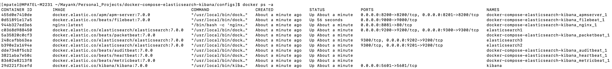
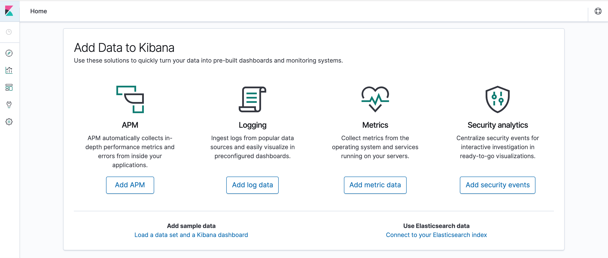
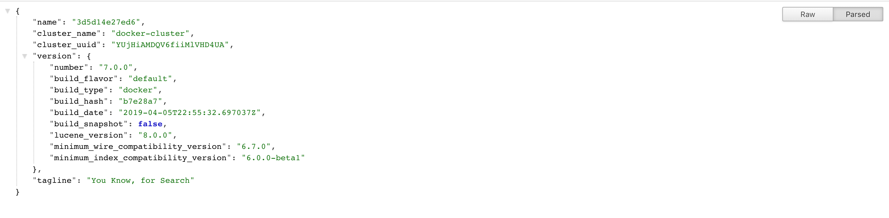

# **docker-compose-elasticsearch-kibana**

# **Overview**
Docker Compose for 3 Node Elasticsearch (7.2.0) Cluster and Kibana (7.2.0) Instance for development purposes.

- [x] 3 Node Elasticsearch version 7.2.0
- [x] Kibana version 7.2.0
- [x] Audit Beat version 7.2.0
- [x] Metric Beat version 7.2.0
- [x] Heart Beat version 7.2.0
- [x] Packet Beat version 7.2.0
- [x] File Beat version 7.2.0
- [x] APM Server version 7.2.0
- [x] APM Search 7.2.0
- [x] NGINX

# **NOTES**
- If you need Open Source version then change Elasticsearch and Kibana Images to elasticsearch-oss and kibana-oss respectively.
- Kibana is being served behind Nginx Proxy so you can secure access of kibana for your purpose.

# **COMING UP DOCKER APPLICATION PACKAGE FOR SWARM**

## **Requirements**
- [x] Docker 18.05
- [x] Docker-compose 1.21

### **Start Stack in Daemon Mode**
```
docker-compose up -d
```

### **Check status of docker-compose cluster**
```
docker-compose ps -a
```



### **Stop Compose Stack**
```
docker-compose down
```

### **Cluster Node Info**
```
curl http://localhost:9200/_nodes?pretty=true
```

### **Access Kibana**
```
http://localhost:5601
```

## **Validate Kibana is running**


### **Accessing Kibana through Nginx**
```
http://localhost:8080
```

### **Access Elasticsearch**
```
http://localhost:9200
```
## **Validate Elasticsearch is running**


# **Resources**
* [Hands on Elasticsearch](https://medium.com/@maxy_ermayank/hands-on-elasticsearch-8fa59d8aebfc)
* [Elasticsearch Resources](https://medium.com/@maxy_ermayank/elasticsearch-resources-27d24f01c1dc)
* [Open Distro Elasticsearch](https://medium.com/@maxy_ermayank/tl-dr-aws-open-distro-elasticsearch-fc642f0e592a)
